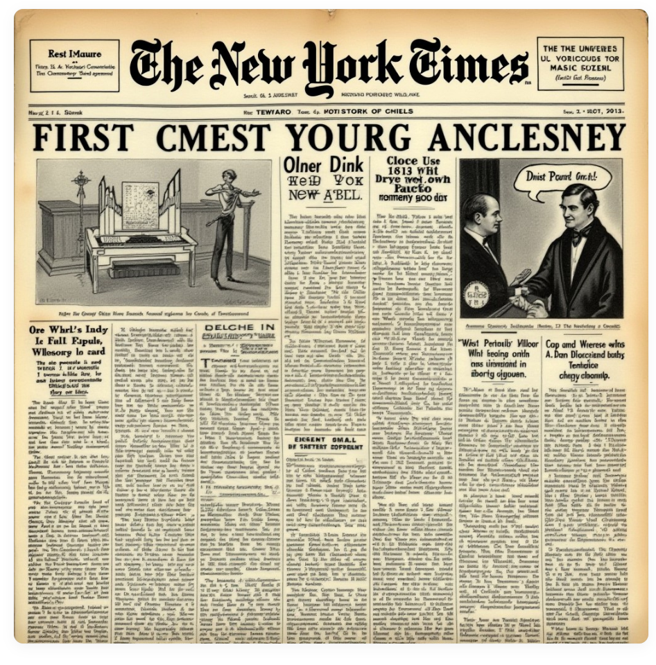
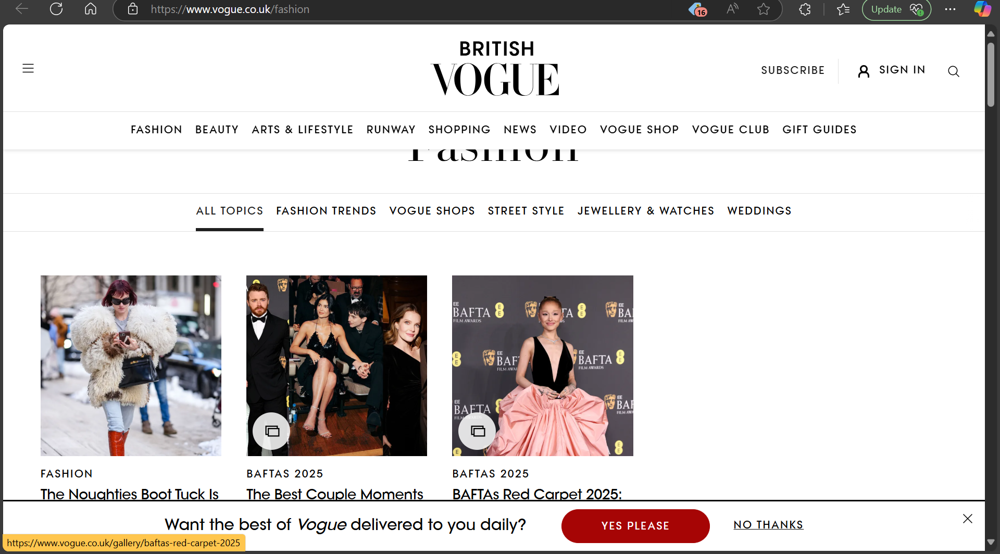
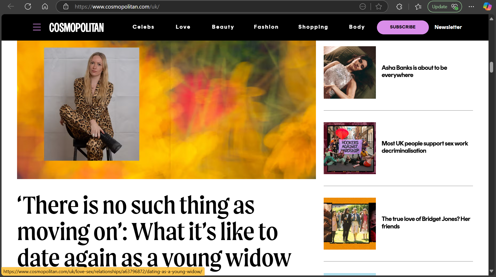
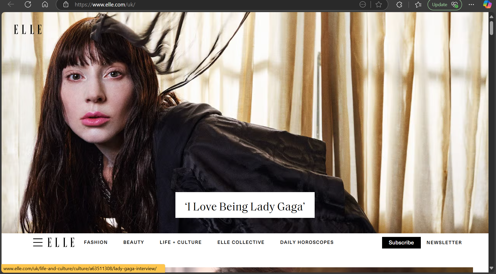
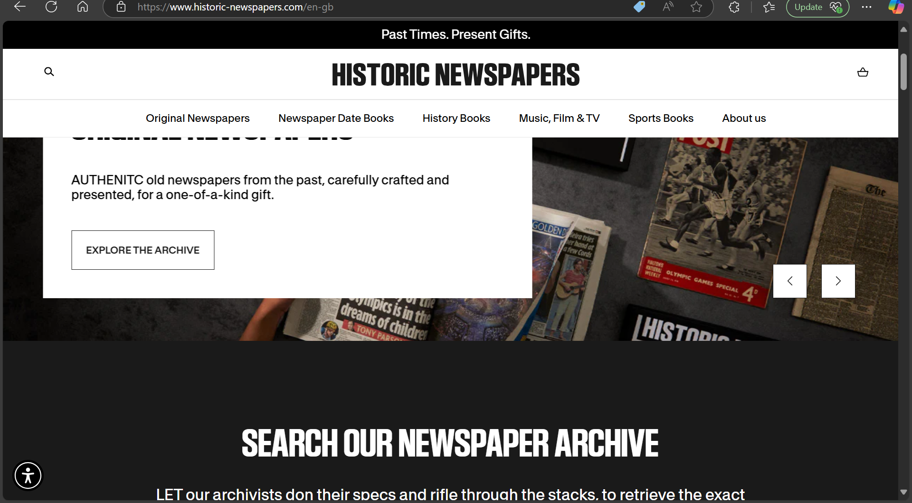
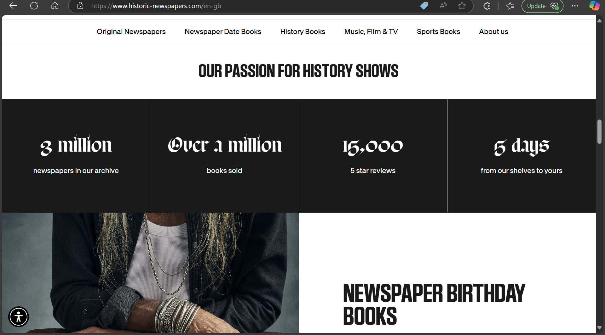
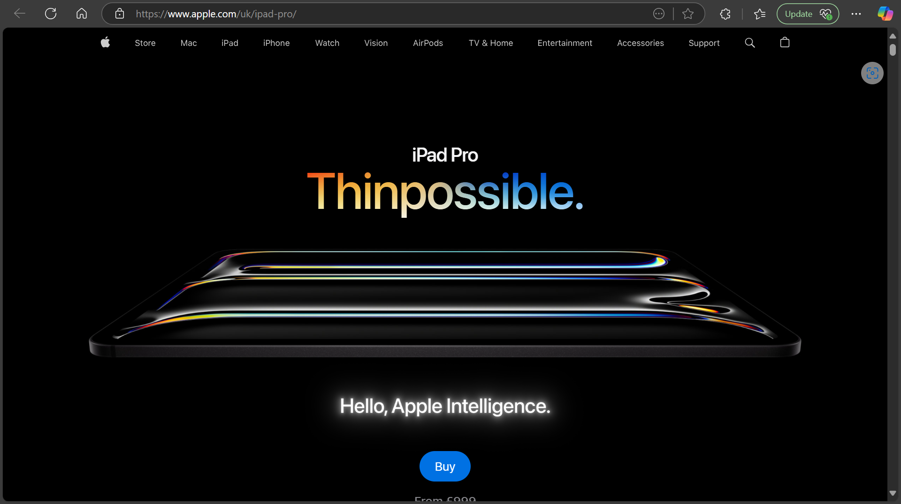
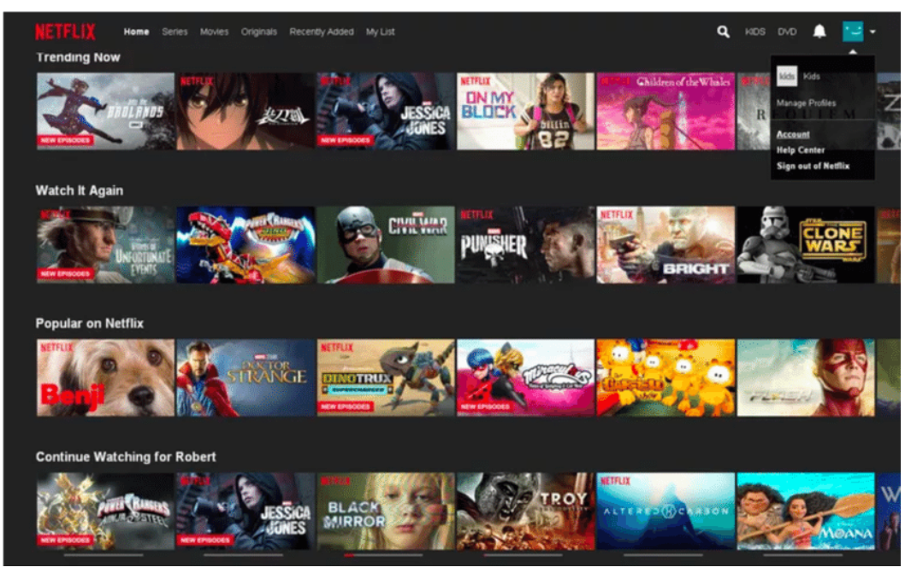
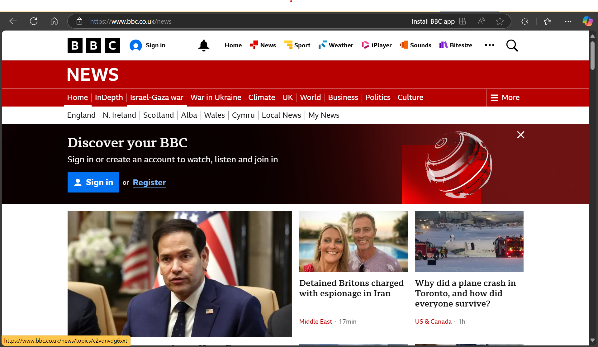
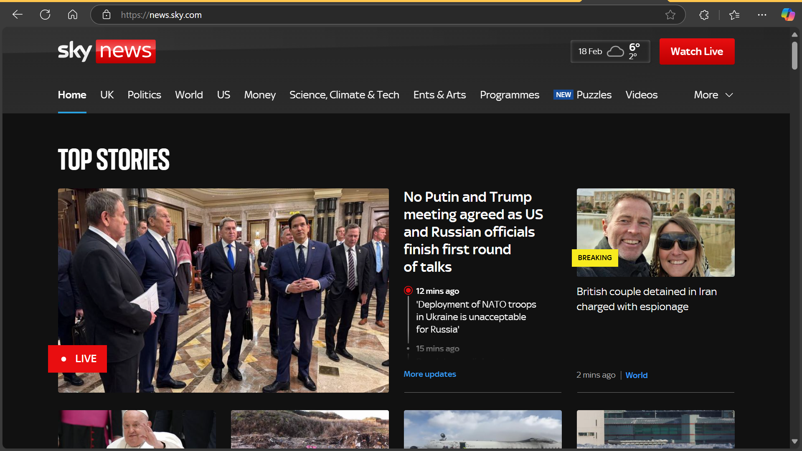

# Research & Inspo:

This is the main theme, we were inspired by old looking The New York Times newspapers. If possible we would like to attempt to recreate the colours, font and style in website form.
 
These are already existing & successful entertainment/pop/fashion pages:
 
 

^ One common theme you see in all of them is they are very basic & simple with different elements at the center to grab attention. Black and white and the pictures bring in all the colour.

    This works well with the theme discussed above, by keeping it basic black and white (ish) and then the different pictures bring in the colour.
This is the current The New York Times website, to see how it has been implemented.
 

This website I feel is a modern spin on The New York Times website, which we can use to join both elements to bring a timeless experience to viewers.
 
 
These are just two websites that I think are very cool and are honestly there to inspire me to do more (though I doubt)
 

These are two current "successful" news websites.

# Ideas

At the moment my favourite idea is:

    We have the whole page in beige and brown (As seen in the playing-around-branch), and only when the mouse hovers over the pictures do the colours come to life.
        ^This is in terms of colour schemes.
    I want it to be very simple looking like the inpo pics above with certain pictures bigger than others so that they pop out.
    
    As for layout & design, I want the page to be divided into different layers/sections: music/films/fashion/celebrities.
        Wether they will all be on the same page or will I have a different page for each, honestly not sure yet. (to be contiued...)
    Somewhere at the top of the page there will be one of those sliding news shows things idk what they are called, that shows the latest news.

    I am still not sure if I want it to look like a newspaper with columns or more like a news website with rows with different stories.

# Wireframes/templates/prototypes
No wireframe at this point because I cannot make up my mind and decide.

# Plan to implement HTML/CSS/JS

HTML: The web page (possibly multiple)
CSS: As mentioned above and shown in the inspo pages, style the page
JS: As mentioned above and shown in the inspo pages.
    I think the biggest JS & CSS implementations will be the page staying in two colours then the colour changing as you hover over it.

# Any additional features or Ideas
None at the moment